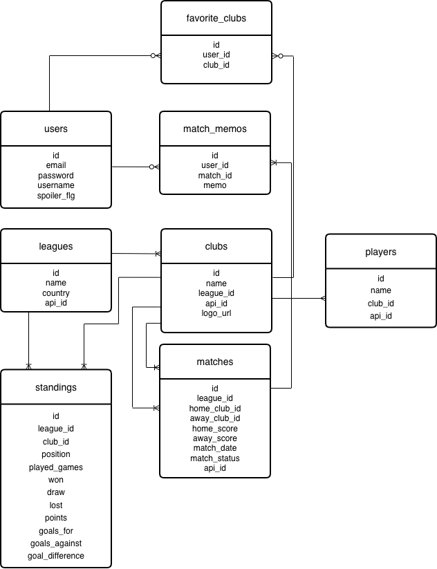

# Euro Dashboard

**日本人選手が活躍する欧州リーグをまとめて追えるサッカー観戦管理アプリ**

---

## サービス概要

Euro Dashboard は、久保建英・三笘薫など日本人選手が活躍する欧州リーグの試合日程・結果・順位を一画面で確認できる Web アプリです。お気に入りのクラブを登録するだけで、毎週 Google で検索していた手間がなくなります。試合日時は自動で日本時間に変換され、ネタバレ防止モードで録画観戦派にも対応します。

### 解決したい課題

- 毎週「久保 試合 いつ」などと検索しなければならない
- ベルギー・オランダなど 5 大リーグ以外の情報が既存サービスでは薄い
- 複数リーグの情報が分散していて一画面で確認できない
- 試合時刻が現地時間のまま表示され、日本時間に換算する手間がある

---

## 画面イメージ

### トップ / ダッシュボード
<!-- スクリーンショットが撮れたらここに追加 -->


### 試合日程一覧


### マイページ（お気に入りクラブ）


---

## 機能一覧

### コア機能
- 試合日程・結果の一覧表示（外部 API 連携）
- リーグ別順位表の表示
- 試合日時の日本時間自動変換
- リーグ・クラブでの絞り込み・検索

### ユーザー機能
- 会員登録・ログイン（Laravel Breeze）
- お気に入りクラブの登録・マイページ
- 観戦メモ機能（試合ごとにコメントを保存）

### 差別化機能
- 試合結果の表示 / 非表示切り替え（ネタバレ防止モード）
- ベルギー 1 部・エールディビジ（オランダ）リーグへの対応

### 対応リーグ

| リーグ | 主な日本人選手 | 備考 |
| --- | --- | --- |
| プレミアリーグ | 三笘薫・鎌田大地 | 知名度・集客力◎ |
| ラ・リーガ | 久保建英 | 人気◎ |
| ブンデスリーガ | 堂安律・佐野海舟など | 日本人選手が多い |
| ベルギー 1 部 | 複数の日本人選手 | 他サービスが手薄・独自性の核 |
| エールディビジ | 複数の日本人選手 | 同上 |

---

## 使用技術・構成

| カテゴリ | 技術・ツール |
| --- | --- |
| バックエンド | PHP / Laravel |
| フロントエンド | Blade / Tailwind CSS / JavaScript |
| データベース | MySQL |
| 外部 API | football-data.org（無料枠） |
| 認証 | Laravel Breeze |
| バージョン管理 | Git / GitHub |
| デプロイ | Render / Railway |

---

## DB 設計

### ER 図
<!-- ER図画像が用意できたらここに追加 -->


### 主要テーブル

| テーブル名 | 主なカラム | 説明 |
| --- | --- | --- |
| users | id, name, email, password | ユーザー情報 |
| clubs | id, name, league_id, api_club_id | クラブ情報 |
| leagues | id, name, country, api_league_id | リーグ情報 |
| matches | id, home_club_id, away_club_id, match_date, score | 試合情報 |
| favorite_clubs | id, user_id, club_id | お気に入りクラブ |
| match_memos | id, user_id, match_id, memo | 観戦メモ |

---

## 環境構築手順

### 必要環境

- PHP 8.2 以上
- Composer
- Node.js 18 以上
- MySQL 8.0 以上

### セットアップ

**① リポジトリをクローン**
```bash
git clone https://github.com/your-name/euro-dashboard.git
cd euro-dashboard
```

**② 依存パッケージをインストール**
```bash
composer install
npm install && npm run build
```

**③ 環境設定**
```bash
cp .env.example .env
php artisan key:generate
```

`.env` に以下を追記してください。

```env
DB_DATABASE=euro_dashboard
DB_USERNAME=your_db_user
DB_PASSWORD=your_db_password

FOOTBALL_API_KEY=your_football_data_org_api_key
```

**④ DB マイグレーション**
```bash
php artisan migrate --seed
```

**⑤ 開発サーバー起動**
```bash
php artisan serve
```

→ http://localhost:8000 でアクセスできます。

---

## 工夫した点・苦労した点

### 工夫した点

- **「日本人選手が活躍するリーグ」という切り口**で、既存サービスにない独自性を打ち出した
- ベルギー・オランダリーグを含めることで、情報が手薄なリーグをカバー
- ネタバレ防止モードを実装し、録画観戦派のニーズにも対応
- 外部 API のレスポンスを DB にキャッシュし、API 制限を考慮した設計

### 苦労した点

- 外部 API の仕様変更に対応できるよう、API 取得処理を疎結合に設計すること
- 複数リーグ・複数タイムゾーンの日時処理を正確に日本時間へ変換する実装
- お気に入りクラブ登録によるパーソナライズと、全体表示のバランス調整
